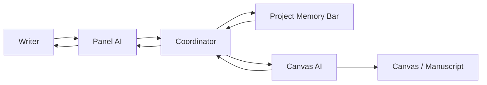

# Dual-Model Workflow Proposal

## Product summary

BookWork works best when it is treated as a coordinated system with three layers:

- **Panel AI**: the user-facing conversational editor in the side panel.
- **Canvas AI**: the document-facing agent that inspects, annotates, rewrites, or verifies the manuscript.
- **Project Memory Bar**: the shared layer at the top that stores reusable project context for both AIs.

The value is not just “two models on screen.” The value comes from keeping each role narrow and dependable:

- the Panel AI owns intent, planning, clarification, delegation, and user-facing explanations,
- the Canvas AI owns page-aware execution and manuscript analysis,
- and the Project Memory Bar owns stable project facts that should outlive a single chat turn.

## High-level flow



## Recommended UI layout

### 1. Top: Project Memory Bar

The top shelf should be a structured shared memory system, not just a file upload drop zone.

#### Shared memory modules

- **Characters**
  - name
  - aliases
  - role in story
  - personality traits
  - speech style
  - relationships
  - secrets
  - current arc state
- **World / lore**
  - places
  - timeline events
  - factions
  - rules
  - glossary
- **Story planning**
  - outline
  - scene goals
  - chapter objectives
  - unresolved threads
- **Reference / RAG**
  - uploaded PDFs
  - notes
  - research links
  - style guides
  - prior editorial memos

#### Why this matters

This gives both AIs a common source of truth. If the user updates a character trait or a world rule, both the Panel AI and the Canvas AI should see the same revision without needing the entire chat history replayed.

### 2. Side panel: Panel AI

The side panel should feel like the writer's editor, producer, and command console.

The user can say things like:

- “Tell the canvas AI to inspect page 47 for grammar and continuity issues.”
- “Ask the other model to rewrite this paragraph in Mara's voice.”
- “Check whether this chapter conflicts with Ava's character sheet.”
- “Use the uploaded outline and see if this scene is missing a promised beat.”

The Panel AI should:

- ask clarifying questions when needed,
- translate loose requests into structured tasks,
- display when it delegated work,
- and summarize results in plain language.

### 3. Main canvas: Canvas AI

The canvas should stay focused on document work instead of becoming a second social chat window.

It should operate on:

- current selection,
- visible page,
- surrounding pages,
- current chapter,
- comments and annotations,
- tracked changes,
- and previewable rewrites.

The Canvas AI should feel like a craft specialist living inside the manuscript.

### 4. Logs and status surface

To keep the handshake trustworthy, add a small log drawer or tray that shows:

- delegated tasks
- accepted tasks
- running tasks
- completed tasks
- blocked tasks
- source citations used by the Canvas AI
- and whether the result is only a suggestion or already applied

This is the missing glue between the side chat and the manuscript. Without it, the handoff will feel invisible.

## Handshake model

The safest approach is a **structured handshake** instead of letting one model pass raw prompt text to another.

### Stage 1: user intent arrives in panel chat

Example user request:

> “Tell the other AI to check page 47, compare it to the outline, and fix grammar if needed.”

### Stage 2: Panel AI creates a task request

```json
{
  "task_id": "task_9b2f",
  "origin": {
    "chat_turn_id": "turn_184",
    "requested_by": "user"
  },
  "target": "canvas_ai",
  "task_type": "review_and_revise",
  "scope": {
    "document_id": "manuscript_12",
    "page": 47,
    "surrounding_pages": [46, 48],
    "chapter_id": "ch_07"
  },
  "goals": ["grammar", "continuity", "outline_alignment"],
  "constraints": [
    "preserve_author_voice",
    "only_edit_if_confident",
    "track_all_changes"
  ],
  "memory_refs": [
    "character:ava",
    "outline:chapter_7",
    "style:house_editorial"
  ],
  "permission_mode": "suggest_only"
}
```

### Stage 3: coordinator enriches the task

The orchestration layer should attach:

- manuscript version,
- selected text snapshot,
- retrieved RAG snippets,
- character or lore records from the Project Memory Bar,
- provider / model chosen for the Canvas AI,
- and execution limits such as timeout, max output, or edit permissions.

### Stage 4: Canvas AI acknowledges the job

Before doing expensive work, the Canvas AI should send back an acknowledgement handshake such as:

```json
{
  "task_id": "task_9b2f",
  "status": "accepted",
  "mode": "suggest_only",
  "scope_confirmed": {
    "page": 47,
    "chapter_id": "ch_07"
  },
  "estimated_actions": ["scan", "compare_to_memory", "propose_edits"]
}
```

This prevents the interaction from feeling fake or mysterious. The user should be able to see that the document agent explicitly accepted the work.

### Stage 5: Canvas AI returns results

```json
{
  "task_id": "task_9b2f",
  "status": "completed",
  "findings": [
    {
      "type": "continuity_issue",
      "location": "page_47:paragraph_3",
      "summary": "Ava is described as carrying a silver key, but her character record says she lost it in chapter 5."
    },
    {
      "type": "grammar_issue",
      "location": "page_47:paragraph_5",
      "summary": "Run-on sentence affecting clarity."
    }
  ],
  "edits": [
    {
      "location": "page_47:paragraph_5",
      "mode": "tracked_change",
      "reason": "grammar_clarity"
    }
  ],
  "sources_used": [
    "character:ava",
    "outline:chapter_7"
  ]
}
```

### Stage 6: Panel AI explains the result

The Panel AI should tell the user:

- what the Canvas AI checked,
- what it found,
- what was changed,
- what sources were consulted,
- and whether the user should approve or review anything.

## Role boundaries

This split only works if each role stays distinct.

### Panel AI responsibilities

- conversation and clarification,
- delegation,
- preference gathering,
- editorial framing,
- summarizing results,
- and planning follow-up actions.

### Canvas AI responsibilities

- page- and selection-level analysis,
- rewrite generation,
- annotation placement,
- comparison against memory / RAG sources,
- and structured edit output.

### Project Memory Bar responsibilities

- reusable facts,
- shared retrieval targets,
- pinned project rules,
- provider-neutral embeddings / indexing,
- and stable references that both AIs can cite.

### Local project storage

To keep the system efficient, project memory should be stored locally in a structured project cache instead of being rebuilt from scratch every time. A practical version would keep:

- character cards
- lore records
- outline nodes
- source metadata
- vector index files
- and recent task results

That lets both AIs pull the same local facts quickly while keeping the live chat context smaller.

## Why this beats one giant model

### 1. Separate context windows

The Panel AI keeps the chat and user preferences. The Canvas AI keeps the document scope and revision materials.

### 2. Better cost control

You can run a cheaper local model in the side panel while reserving a stronger hosted model for high-value canvas tasks.

### 3. Better UX clarity

The user always knows where to talk and where the work happens.

### 4. Better system performance

The system does not need to push the whole manuscript through the same chat context on every turn.

## Suggested task types

Start with a narrow, explicit task catalog:

- `document_review`
- `review_and_revise`
- `rewrite_selection`
- `continuity_check`
- `style_alignment`
- `fact_check_against_memory`
- `compare_scene_to_outline`
- `summarize_chapter`
- `compare_versions`

Every task should include:

- task ID,
- originating chat turn,
- target role,
- scope,
- goals,
- constraints,
- memory references,
- permission mode,
- provider / model assignment,
- and expected response shape.

## Permissions and trust

### Scope guardrails

Every canvas task should declare exactly which part of the manuscript may be read or modified.

### Edit guardrails

Supported execution modes should be:

- `read_only`
- `suggest_only`
- `apply_with_confirmation`
- `auto_apply`

Default should be `suggest_only`.

### Citation guardrails

Whenever the Canvas AI uses character records, lore, outline material, or uploaded RAG sources, the UI should surface which sources informed the result.

### Version guardrails

All returned edits should be bound to a manuscript version so stale suggestions cannot overwrite fresh writing.

## What to avoid

### Two chatbots talking over the user

Do not make both models equally chatty in the interface.

### Free-form prompt relays

Do not let the Panel AI send uncontrolled natural-language prompts directly into the Canvas AI without a task schema.

### Invisible delegation

Users should always be able to see when work was delegated, accepted, completed, or blocked.

## Best implementation path

### Phase 1: coordinator-first architecture

Ship:

- one visible panel chat,
- one canvas worker path,
- task acknowledgements,
- project memory bar,
- and source-aware results.

### Phase 2: independent model assignment

Ship:

- provider picker for panel and canvas separately,
- per-role system prompts,
- separate context limits,
- and fallback routing if one provider is unavailable.

### Phase 3: richer collaboration

Ship:

- background review queues,
- proactive consistency checks,
- project memory suggestions,
- and reusable editorial workflows.

## Bottom line

Your idea is strong. The cleanest version is:

- **Panel AI** understands the writer.
- **Canvas AI** understands the manuscript.
- **Project Memory Bar** stores the shared facts.
- **Handshake protocol** keeps delegation visible and trustworthy.

That is the version worth building.
